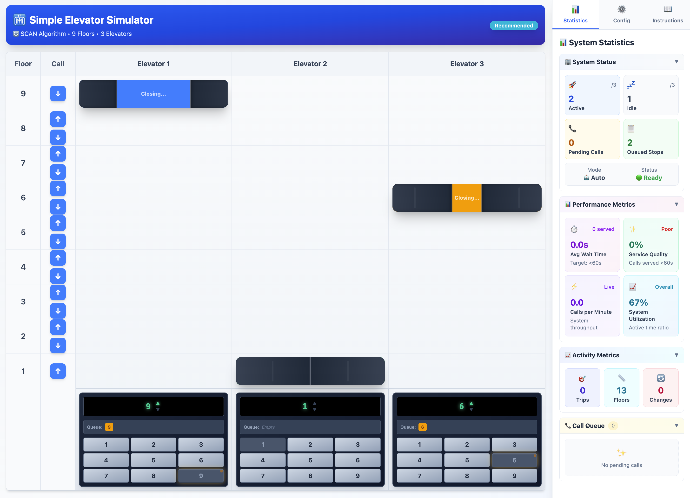

# 🏢 Trình mô phỏng thang máy đơn giản

Một trình mô phỏng lập lịch thang máy tương tác giúp trực quan hóa và so sánh các thuật toán điều phối thang máy khác nhau trong thời gian thực.



## Tính năng

- **Tòa nhà có thể định cấu hình**: 2-24 tầng, 2-12 thang máy
- **Trực quan hóa thời gian thực**: Xem thang máy di chuyển với hoạt ảnh cửa
- **3 thuật toán lập lịch**:
  - **SCAN** ⭐ (Khuyên dùng): Tiêu chuẩn công nghiệp, di chuyển theo một hướng đến điểm cuối cùng rồi đảo ngược
  - **LOOK**: Đảo ngược khi không còn yêu cầu nào ở phía trước (hiệu quả hơn SCAN)
  - **SSTF**: Phục vụ tầng gần nhất trước tiên (mục đích giáo dục, có thể gây ra tình trạng đói)
- **Chế độ thủ công & tự động**: Gán thủ công hoặc điều phối dựa trên thuật toán
- **Thời gian có thể định cấu hình**: Điều chỉnh thời gian di chuyển, tốc độ mở/đóng cửa

## Bắt đầu

### Điều kiện tiên quyết
- Node.js v20.0.0+
- npm v10.0.0+

### Cài đặt

```bash
git clone https://github.com/kinhluan/simple-elevator-simulator.git
cd simple-elevator-simulator
npm install
npm run dev
```

Mở trình duyệt tới `http://localhost:5173`

## Sử dụng

**Chế độ thủ công**: Nhấp vào các nút tầng để yêu cầu thang máy, sau đó gán thủ công cho các cabin cụ thể

**Chế độ tự động**: Chọn một thuật toán (SCAN/LOOK/SSTF) và nhấp vào các nút tầng - thang máy được điều phối tự động

**Cấu hình**: Điều chỉnh kích thước tòa nhà và thời gian trong bảng Cấu hình

## Cấu trúc dự án

```
src/
├── algorithms/          # Triển khai thuật toán lập lịch
│   ├── elevatorScheduler.js
│   ├── scanAlgorithm.js
│   ├── lookAlgorithm.js
│   └── sstfAlgorithm.js
├── components/          # Thành phần React UI
├── hooks/              # useElevatorSystem.js
├── constants/          # elevatorTiming.js
├── styles/             # designSystem.js
└── utils/              # elevatorUtils.js
```

## Công nghệ

- **React 19.0.0** - Framework UI
- **Vite 6.2.0** - Công cụ xây dựng và máy chủ phát triển
- **Tailwind CSS 4.0.17** - CSS ưu tiên tiện ích
- **JavaScript (ES6+)** - Logic cốt lõi
- **ESLint 9.21.0** - Chất lượng mã

## So sánh thuật toán

| Thuật toán | Hướng | Công bằng | Hiệu quả | Rủi ro đói | Sử dụng trong thực tế |
|-----------|-----------|----------|------------|-----------------|----------------|
| **SCAN** ⭐ | ✅ Có | ⭐⭐⭐⭐⭐ | ⭐⭐⭐⭐ | Không | ✅ Tiêu chuẩn |
| **LOOK** | ✅ Có | ⭐⭐⭐⭐ | ⭐⭐⭐⭐⭐ | Rất thấp | ⚠️ Hiếm |
| **SSTF** | ❌ Không | ⭐⭐ | ⭐⭐⭐ | Cao | ❌ Không |

**Khi nào nên sử dụng:**
- **SCAN**: Hệ thống sản xuất, lưu lượng truy cập cao (dễ dự đoán nhất, không bị đói)
- **LOOK**: Các mẫu lưu lượng truy cập thay đổi (hiệu quả hơn, tránh các thái cực trống)
- **SSTF**: Chỉ dành cho giáo dục (chứng tỏ các vấn đề đói)

## Triển khai

Triển khai lên GitHub Pages:
```bash
npm run deploy
```

Xây dựng cho sản xuất:
```bash
npm run build
```

## Giấy phép

Giấy phép MIT

## Ghi nhận

Nguồn cảm hứng ban đầu từ [arunsai63/SmartLift](https://github.com/arunsai63/SmartLift)