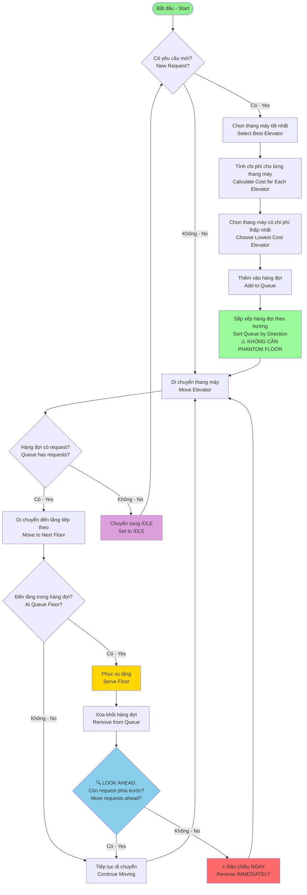

# Mermaid Flowcharts - Thuật Toán LOOK (LOOK Algorithm)

Tài liệu này chứa các sơ đồ Mermaid để trực quan hóa flow xử lý của thuật toán LOOK.

## Flow Tổng Quan (Overall Flow)

```mermaid
graph TD
    Start([Bắt đầu - Start]) --> NewRequest{Có yêu cầu mới?<br/>New Request?}

    NewRequest -->|Có - Yes| SelectElevator[Chọn thang máy tốt nhất<br/>Select Best Elevator]
    NewRequest -->|Không - No| MoveElevator[Di chuyển thang máy<br/>Move Elevator]

    SelectElevator --> CalcCost[Tính chi phí cho từng thang máy<br/>Calculate Cost for Each Elevator]
    CalcCost --> ChooseBest[Chọn thang máy có chi phí thấp nhất<br/>Choose Lowest Cost Elevator]
    ChooseBest --> AddToQueue[Thêm vào hàng đợi<br/>Add to Queue]
    AddToQueue --> SortQueue[Sắp xếp hàng đợi theo hướng<br/>Sort Queue by Direction<br/>⚠️ KHÔNG CẦN PHANTOM FLOOR]
    SortQueue --> MoveElevator

    MoveElevator --> HasQueue{Hàng đợi có request?<br/>Queue has requests?}
    HasQueue -->|Có - Yes| MoveToNext[Di chuyển đến tầng tiếp theo<br/>Move to Next Floor]
    HasQueue -->|Không - No| Idle[Chuyển sang IDLE<br/>Set to IDLE]

    MoveToNext --> AtFloor{Đến tầng trong hàng đợi?<br/>At Queue Floor?}
    AtFloor -->|Có - Yes| ServeFloor[Phục vụ tầng<br/>Serve Floor]
    AtFloor -->|Không - No| Continue[Tiếp tục di chuyển<br/>Continue Moving]

    ServeFloor --> RemoveFromQueue[Xóa khỏi hàng đợi<br/>Remove from Queue]
    RemoveFromQueue --> LookAhead{🔍 LOOK AHEAD:<br/>Còn request phía trước?<br/>More requests ahead?}

    LookAhead -->|Có - Yes| Continue
    LookAhead -->|Không - No| EarlyReverse[⚡ Đảo chiều NGAY<br/>Reverse IMMEDIATELY]

    EarlyReverse --> MoveElevator
    Continue --> MoveElevator
    Idle --> NewRequest

    style Start fill:#90EE90
    style ServeFloor fill:#FFD700
    style EarlyReverse fill:#FF6B6B
    style LookAhead fill:#87CEEB
    style Idle fill:#DDA0DD
    style SortQueue fill:#98FB98
```
