# Mermaid Flowcharts - Thuật Toán SCAN (SCAN Algorithm)

Tài liệu này chứa các sơ đồ Mermaid để trực quan hóa flow xử lý của thuật toán SCAN.

---

## 📋 Mục Lục

1. [Flow Tổng Quan](#1-flow-tổng-quan-overall-flow)
2. [Flow Chọn Thang Máy](#2-flow-chọn-thang-máy-elevator-selection-flow)
3. [Flow Tính Chi Phí](#3-flow-tính-chi-phí-cost-calculation-flow)
4. [Flow Đảo Chiều](#4-flow-đảo-chiều-direction-reversal-flow)
5. [Flow Phantom Floor](#5-flow-phantom-floor)
6. [State Machine](#6-state-machine-máy-trạng-thái)
7. [Flow Xử Lý Request](#7-flow-xử-lý-request-request-handling-flow)

---

## 1. Flow Tổng Quan (Overall Flow)

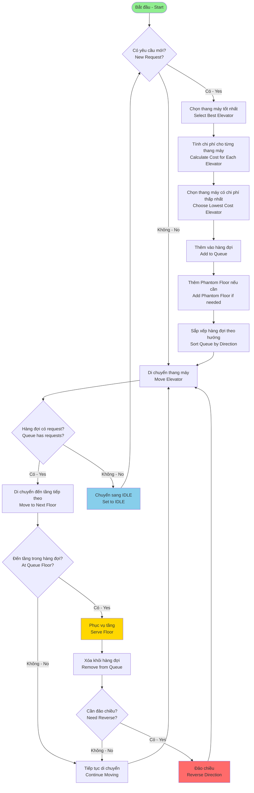

---

## 2. Flow Chọn Thang Máy (Elevator Selection Flow)

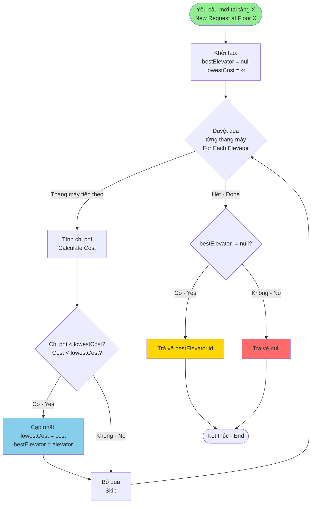

---

## 3. Flow Tính Chi Phí (Cost Calculation Flow)

```mermaid
graph TD
    Start([Tính chi phí<br/>Calculate Cost]) --> CheckIdle{Thang máy IDLE?<br/>Elevator IDLE?}

    CheckIdle -->|Có - Yes| SimpleCost[Chi phí = |currentFloor - callFloor|<br/>Cost = Distance]
    CheckIdle -->|Không - No| CheckDirection{Hướng di chuyển?<br/>Direction?}

    CheckDirection -->|UP - Lên| CheckUpCase{callFloor >= currentFloor<br/>&&<br/>callDirection == UP?}
    CheckDirection -->|DOWN - Xuống| CheckDownCase{callFloor <= currentFloor<br/>&&<br/>callDirection == DOWN?}

    CheckUpCase -->|Có - Yes| BestCaseUp[✅ Trường hợp tốt nhất<br/>Chi phí = callFloor - currentFloor]
    CheckUpCase -->|Không - No| WorstCaseUp[⚠️ Phải hoàn thành quét<br/>Chi phí = distToTop + distFromTop + 100]

    CheckDownCase -->|Có - Yes| BestCaseDown[✅ Trường hợp tốt nhất<br/>Chi phí = currentFloor - callFloor]
    CheckDownCase -->|Không - No| WorstCaseDown[⚠️ Phải hoàn thành quét<br/>Chi phí = distToBottom + distFromBottom + 100]

    SimpleCost --> Return([Trả về chi phí<br/>Return Cost])
    BestCaseUp --> Return
    WorstCaseUp --> Return
    BestCaseDown --> Return
    WorstCaseDown --> Return

    style Start fill:#90EE90
    style BestCaseUp fill:#90EE90
    style BestCaseDown fill:#90EE90
    style WorstCaseUp fill:#FFB6C1
    style WorstCaseDown fill:#FFB6C1
    style SimpleCost fill:#87CEEB
```

### Chi Tiết Công Thức (Formula Details)

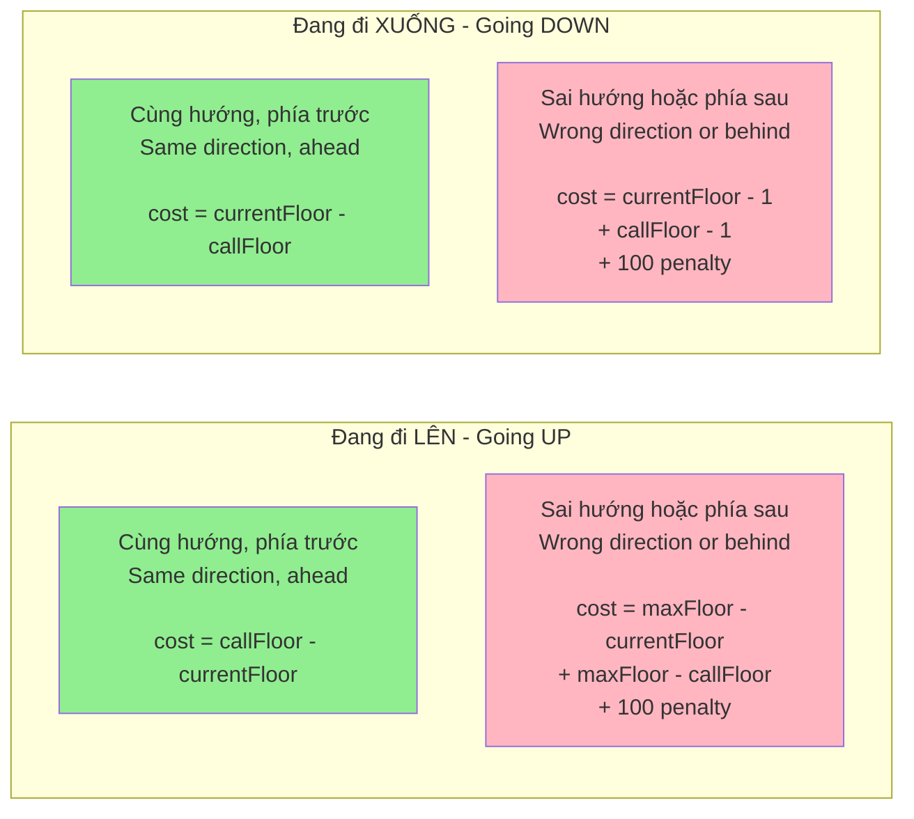

---

## 4. Flow Đảo Chiều (Direction Reversal Flow)

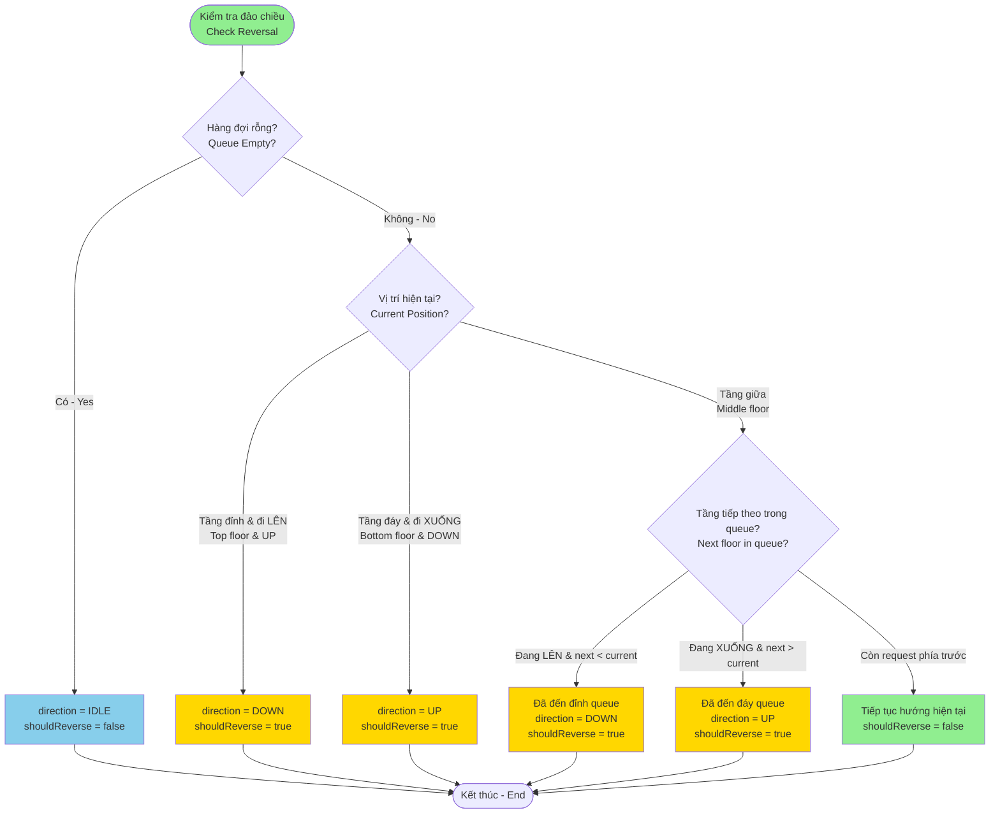

---

## 5. Flow Phantom Floor

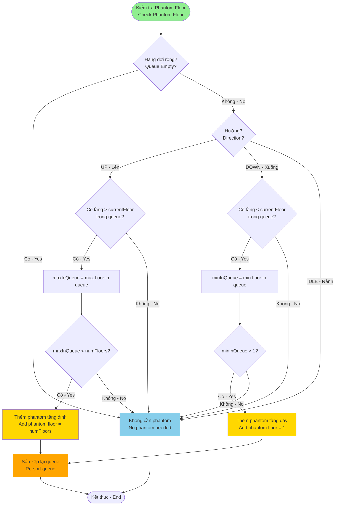

### Ví Dụ Phantom Floor (Example)

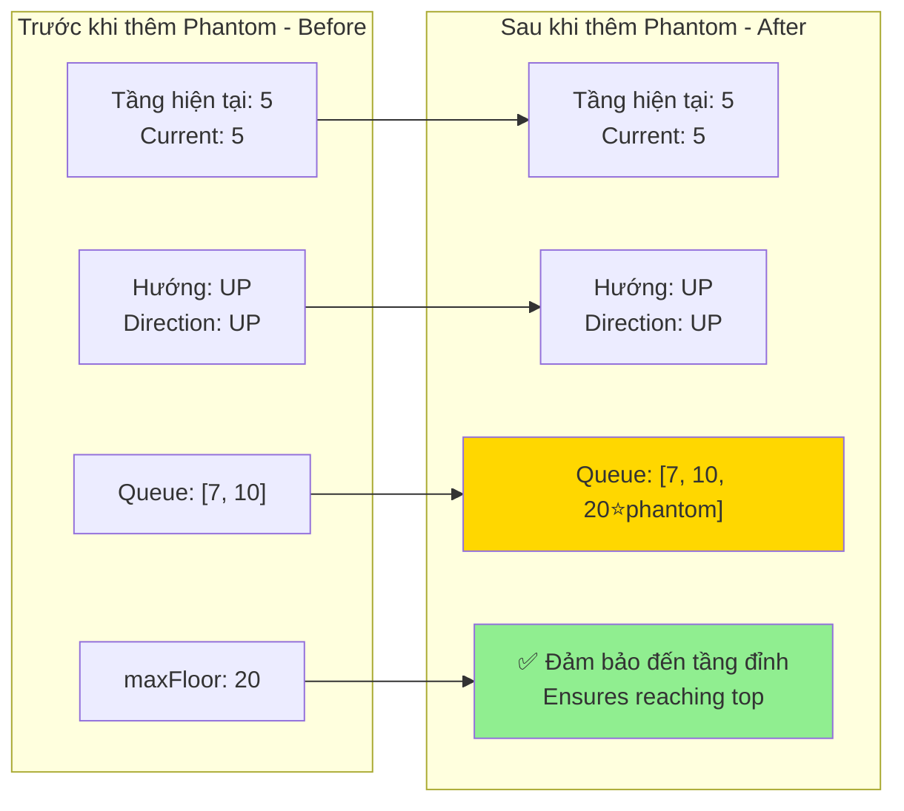

---

## 6. State Machine (Máy Trạng Thái)

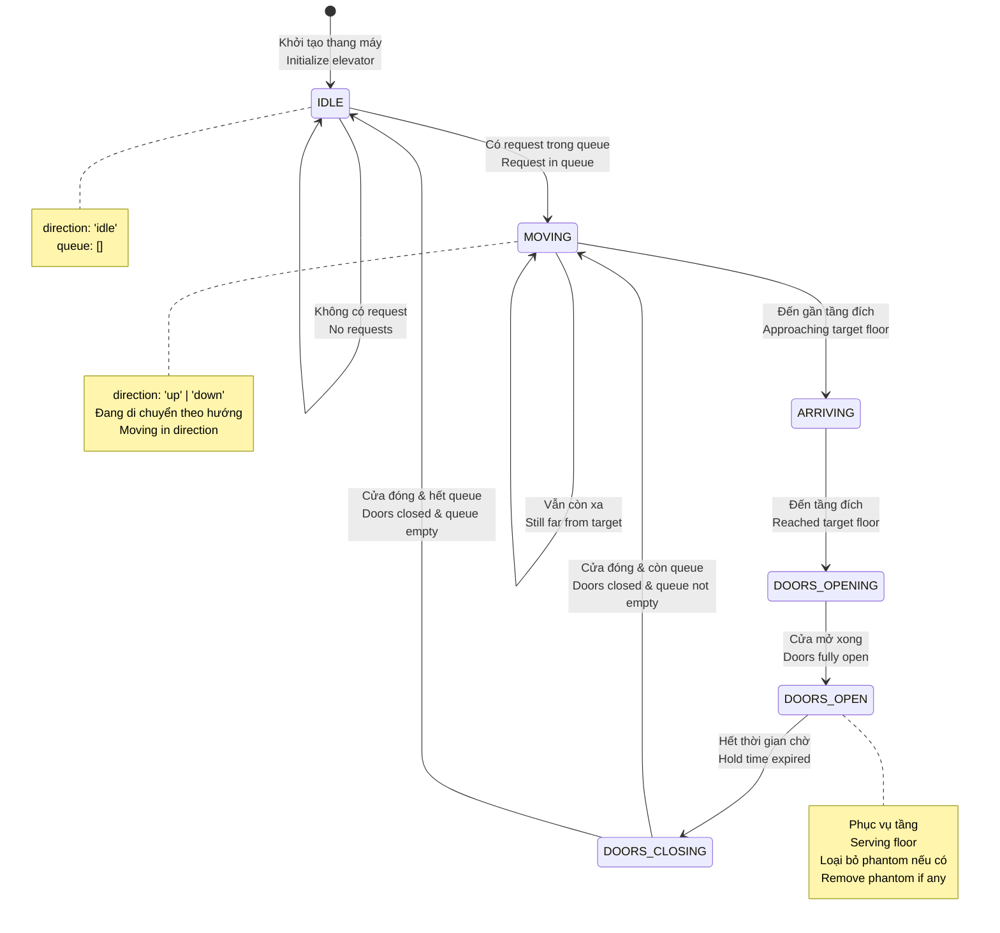

### State Transitions với SCAN Logic

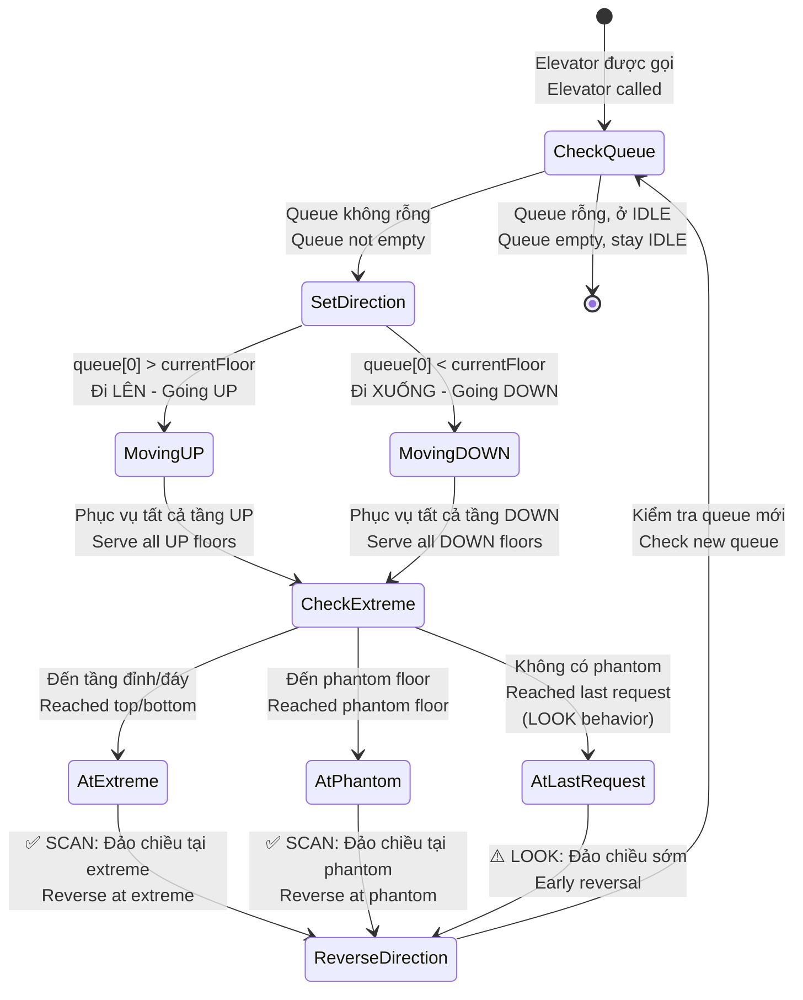

---

## 7. Flow Xử Lý Request (Request Handling Flow)

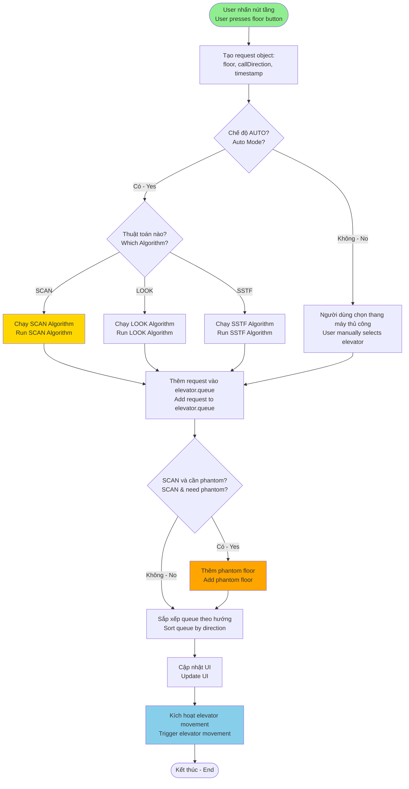

---

## 8. Flow So Sánh SCAN vs LOOK vs SSTF

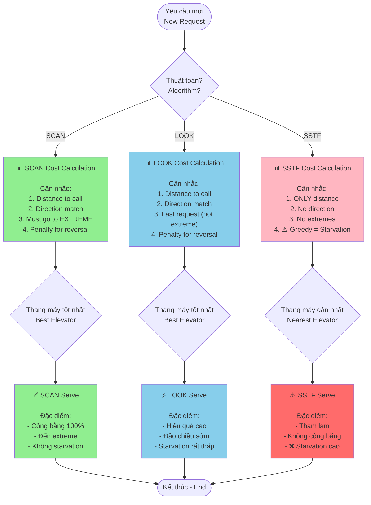

---

## 9. Timeline Flow - Ví Dụ Thực Tế

```mermaid
gantt
    title Ví dụ SCAN - 10 tầng, 1 thang máy
    dateFormat X
    axisFormat %s

    section Requests
    Request tầng 5 UP     :milestone, r1, 0, 0s
    Request tầng 8 UP     :milestone, r2, 5, 0s
    Request tầng 3 DOWN   :milestone, r3, 6, 0s
    Request tầng 7 UP     :milestone, r4, 9, 0s

    section Elevator Movement
    Tầng 1→5 (UP)         :active, m1, 0, 5s
    Phục vụ tầng 5        :crit, s1, 5, 1s
    Tầng 5→8 (UP)         :active, m2, 6, 3s
    Phục vụ tầng 8        :crit, s2, 9, 1s
    Tầng 8→10 (EXTREME)   :done, m3, 10, 2s
    Đảo chiều tại 10      :milestone, rev, 12, 0s
    Tầng 10→7 (DOWN)      :active, m4, 12, 3s
    Phục vụ tầng 7        :crit, s3, 15, 1s
    Tầng 7→3 (DOWN)       :active, m5, 16, 4s
    Phục vụ tầng 3        :crit, s4, 20, 1s
```

---

## 10. Decision Tree - Lựa Chọn Thuật Toán

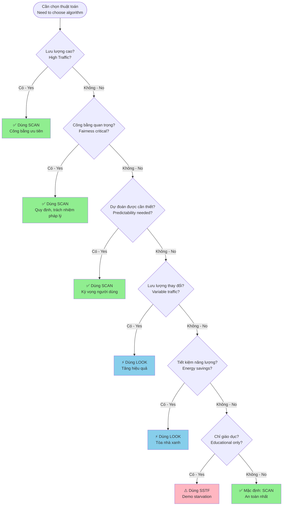

---

## 📝 Cách Sử Dụng (How to Use)

### Render Mermaid Diagrams

Các sơ đồ Mermaid có thể được render bởi:

1. **GitHub** - Tự động render trong markdown
2. **VS Code** - Sử dụng extension "Markdown Preview Mermaid Support"
3. **Online Editors**:
   - [Mermaid Live Editor](https://mermaid.live/)
   - [Mermaid Chart](https://www.mermaidchart.com/)

### Export Images

Để export thành hình ảnh:

```bash
# Sử dụng mermaid-cli
npm install -g @mermaid-js/mermaid-cli

# Render một diagram
mmdc -i SCAN_FLOWCHARTS.md -o output.png -t default
```

---

## 🔗 Links Tham Khảo (Reference Links)

- [Tài liệu SCAN Algorithm](./SCAN_ALGORITHM.md)
- [Mermaid Documentation](https://mermaid.js.org/)
- [Implementation Code](../src/algorithms/scanAlgorithm.js)

---

**Phiên bản (Version)**: 1.0
**Cập nhật lần cuối (Last Updated)**: 2025-11-08
**Tác giả (Author)**: Luân B
